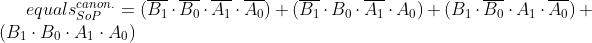
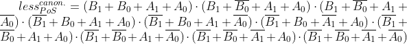
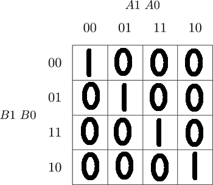
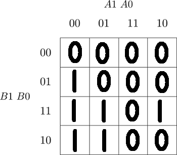
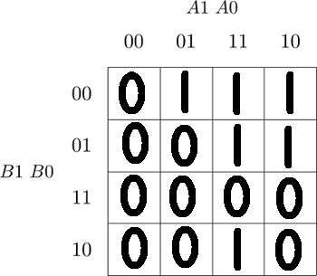
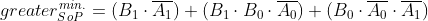
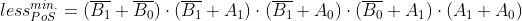

# Assigment 02-logic

## Preparation:
### Truth table:

| **Dec. equivalent** | **B[1:0]** | **A[1:0]** | **B is greater than A** | **B equals A** | **B is less than A** |
| :-: | :-: | :-: | :-: | :-: | :-: |
| 0 | 0 0 | 0 0 | 0 | 1 | 0 |
| 1 | 0 0 | 0 1 | 0 | 0 | 1 |
| 2 | 0 0 | 1 0 | 0 | 0 | 1 |
| 3 | 0 0 | 1 1 | 0 | 0 | 1 |
| 4 | 0 1 | 0 0 | 1 | 0 | 0 |
| 5 | 0 1 | 0 1 | 0 | 1 | 0 |
| 6 | 0 1 | 1 0 | 0 | 0 | 1 |
| 7 | 0 1 | 1 1 | 0 | 0 | 1 |
| 8 | 1 0 | 0 0 | 1 | 0 | 0 |
| 9 | 1 0 | 0 1 | 1 | 0 | 0 |
| 10 | 1 0 | 1 0 | 0 | 1 | 0 |
| 11 | 1 0 | 1 1 | 0 | 0 | 1 |
| 12 | 1 1 | 0 0 | 1 | 0 | 0 |
| 13 | 1 1 | 0 1 | 1 | 0 | 0 |
| 14 | 1 1 | 1 0 | 1 | 0 | 0 |
| 15 | 1 1 | 1 1 | 0 | 1 | 0 |

### SoP and PoS functions:






## 2-bit binary comparator:
### Karnaugh Maps:
#### Equal: 

#### Greater:

#### Less:


### Logic function minimization:




### 2-bit binary comparator in VHDL:
Link: https://www.edaplayground.com/x/ZDUV

## 4-bit binary comparator:
### design.vhd; Comparator architecture
```vhdl

------------------------------------------------------------------------
-- Architecture body for 4-bit binary comparator
------------------------------------------------------------------------
architecture Behavioral of comparator_4bit is
begin
    
    B_greater_A_o <= '1' when (b_i > a_i) else '0';
    B_equals_A_o <= '1' when (b_i = a_i) else '0';
    B_less_A_o   <= '1' when (b_i < a_i) else '0';
   
end architecture Behavioral;
```

### testbench.vhd; Stimulus process
```vhdl
  --------------------------------------------------------------------
    -- Data generation process
    --------------------------------------------------------------------
    p_stimulus : process
    begin
        -- Report a note at the begining of stimulus process
        report "Stimulus process started" severity note;


        -- First test values
        s_b <= "0000"; s_a <= "0000"; wait for 100 ns;
        -- Expected output
        assert ((s_B_greater_A = '0') and (s_B_equals_A = '1') and (s_B_less_A = '0'))
        -- If false, then report an error
        report "Test failed for input combination: 0000, 0000" severity error;
        
        s_b <= "0110"; s_a <= "0101"; wait for 100 ns;
        -- Expected output
        assert ((s_B_greater_A = '1') and (s_B_equals_A = '0') and (s_B_less_A = '0'))
        -- If false, then report an error
        report "Test failed for input combination: 0110, 0101" severity error;
        
        s_b <= "1100"; s_a <= "1110"; wait for 100 ns;
        -- Expected output
        assert ((s_B_greater_A = '0') and (s_B_equals_A = '0') and (s_B_less_A = '1'))
        -- If false, then report an error
        report "Test failed for input combination: 1100, 1110" severity error;
        
        s_b <= "0001"; s_a <= "1111"; wait for 100 ns;
        -- Expected output
        assert ((s_B_greater_A = '0') and (s_B_equals_A = '0') and (s_B_less_A = '1'))
        -- If false, then report an error
        report "Test failed for input combination: 0001, 1111" severity error;
        
        s_b <= "0101"; s_a <= "0101"; wait for 100 ns;
        -- Expected output
        assert ((s_B_greater_A = '0') and (s_B_equals_A = '1') and (s_B_less_A = '0'))
        -- If false, then report an error
        report "Test failed for input combination: 0101, 0101" severity error;
        
        s_b <= "1111"; s_a <= "0000"; wait for 100 ns;
        -- Expected output
        assert ((s_B_greater_A = '1') and (s_B_equals_A = '0') and (s_B_less_A = '0'))
        -- If false, then report an error
        report "Test failed for input combination: 1111, 0000" severity error;
        
        s_b <= "1001"; s_a <= "0110"; wait for 100 ns;
        -- Expected output
        assert ((s_B_greater_A = '1') and (s_B_equals_A = '0') and (s_B_less_A = '0'))
        -- If false, then report an error
        report "Test failed for input combination: 1001, 0110" severity error;
        
        s_b <= "1110"; s_a <= "0111"; wait for 100 ns;
        -- Expected output
        assert ((s_B_greater_A = '1') and (s_B_equals_A = '0') and (s_B_less_A = '0'))
        -- If false, then report an error
        report "Test failed for input combination: 1110, 0111" severity error;
        
        s_b <= "1011"; s_a <= "1101"; wait for 100 ns;
        -- Expected output
        assert ((s_B_greater_A = '0') and (s_B_equals_A = '0') and (s_B_less_A = '1'))
        -- If false, then report an error
        report "Test failed for input combination: 1011, 1101" severity error;
        
        s_b <= "1000"; s_a <= "0110"; wait for 100 ns;
        -- Expected output
        assert ((s_B_greater_A = '1') and (s_B_equals_A = '0') and (s_B_less_A = '0'))
        -- If false, then report an error
        report "Test failed for input combination: 1000, 0110" severity error;
        
        s_b <= "1001"; s_a <= "1110"; wait for 100 ns;
        -- Expected output
        assert ((s_B_greater_A = '0') and (s_B_equals_A = '1') and (s_B_less_A = '0'))
         report "Test failed for input combination: 1001, 1110" severity error;
         
       report "Stimulus process finished" severity note;
       wait;
       end process p_stimulus;
       
       end architecture testbench;
 ```

### Console output:

[2021-02-18 17:38:05 EST] ghdl -i design.vhd testbench.vhd  && ghdl -m  tb_comparator_4bit && ghdl -r  tb_comparator_4bit   --vcd=dump.vcd && sed -i 's/^U/X/g; s/^-/X/g;   s/^H/1/g; s/^L/0/g' dump.vcd   
analyze design.vhd  
analyze testbench.vhd  
elaborate tb_comparator_4bit  
testbench.vhd:41:9:@0ms:(report note): Stimulus process started  
testbench.vhd:107:9:@1100ns:(assertion error): Test failed for input combination: 1001, 1110  
testbench.vhd:110:8:@1100ns:(report note): Stimulus process finished  
Finding VCD file...  
./dump.vcd  
[2021-02-18 17:38:06 EST] Opening EPWave...  
Done  

### 4-bit binary comparator in VHDL:
Link: https://www.edaplayground.com/x/sYUH
