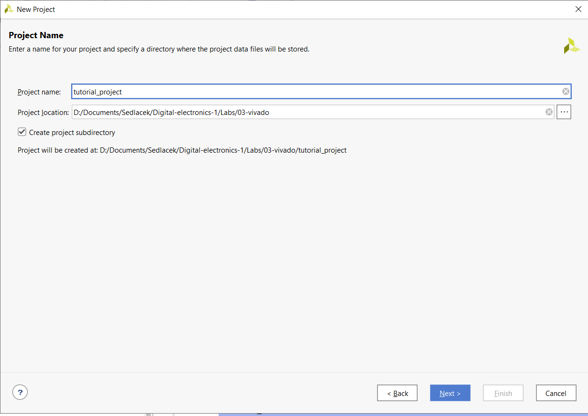

# Lab 03-vivado

## LED and switch connections for Nexys A7:


| **LED** | **Pin** | **Switch** | **Pin** | 
| :-: | :-: | :-: | :-: |
| LED0 | H17 | SW0 | J15 |
| LED1 | K15 | SW1 | L16 |
| LED2 | J13 | SW2 | M13 |
| LED3 | N14 | SW3 | R15 |
| LED4 | R18 | SW4 | R17 |
| LED5 | V17 | SW5 | T18 |
| LED6 | U17 | SW6 | U18 |
| LED7 | U16 | SW7 | R13 |
| LED8 | V16 | SW8 | T8 |
| LED9 | T15 | SW9 | U8 |
| LED10 | U14 | SW10 | R16 |
| LED11 | T16 | SW11 | T13 |
| LED12 | V15 | SW12 | H6 |
| LED13 | V14 | SW13 | U12 |
| LED14 | V12 | SW14 | U11 |
| LED15 | V11 | SW15 | V10 |


## Two-bit 4-to-1 multiplexer
### Architecture from mux_2bit_4to1.vhd:
```vhdl
architecture Behavioral of mux_2bit_4to1 is
begin
    
    f_o <= a_i when (sel_i = "00") else b_i when (sel_i = "01") else c_i when (sel_i = "10") else d_i;
   
end architecture Behavioral;
```
### Stimulus process fromtb_mux_2bit_4to1.vhd:
```vhdl
    
    p_stimulus : process
    begin
        -- Report a note at the begining of stimulus process
        report "Stimulus process started" severity note;


        -- First test values
        s_d <= "00"; s_c <= "00";s_b <= "00"; s_a <= "01";
        s_sel <= "00";
        wait for 100 ns;
        -- Expected output
        s_d <= "00"; s_c <= "00";s_b <= "01"; s_a <= "00";
        s_sel <= "01";
        wait for 100 ns;
        
        s_d <= "00"; s_c <= "01";s_b <= "00"; s_a <= "00";
        s_sel <= "10";
        wait for 100 ns;
        
        s_d <= "01"; s_c <= "00";s_b <= "00"; s_a <= "00";
        s_sel <= "11";
        wait for 100 ns;
        
        s_d <= "00"; s_c <= "11";s_b <= "01"; s_a <= "10";
        s_sel <= "00";
        wait for 100 ns;
        
        s_d <= "00"; s_c <= "11";s_b <= "01"; s_a <= "10";
        s_sel <= "10";
        wait for 100 ns;
        
        
        
        -- Report a note at the end of stimulus process
        report "Stimulus process finished" severity note;
        wait;
    end process p_stimulus;
  ```
### Waveform screenshot:


## Vivado tutorial
### Create project:
In the top left corner click on File>Project>New, follow the instructions of the program (on unmentioned screens just press Next).

Here we name the project and choose the directory. Avoid special symbols, spaces etc., it will confuse the program.

We can add/create source files during the project creation in this part. Just specify VHDL everywhere. After pressing Next constraint source files can be optionally added.

In this part we can choose either the parts or a complete board, whichever will serve our purposes. We can either install new boards through this window, or, in the case it refuses to cooperate, as sometimes happens, we can add them directly through file explorer into the proper folder inside the Xilinx installation.


### Add source files (design, testbench, constraint) after project creation:
We can add source files of our chosen type through right-clicking into the Sources panel and choosing the +Add Source option. The process is the same as it was during the initial creation setup.


### Run simulation:
After actually coding something in VHDL, we can run the simulation by selecting (top left) Flow>Run Simulation>Run Behavioral Simulation.
It's good practice to save before doing this, since a multitude of errors tend to appear in this process and that may result in unpredictable consequences (Vivado corrupts the file, forgets it and refuses to remember, changes won't save etc.). A good error preventing method is adding both the project and Xilinx folders to antivirus exceptions, since it reacts poorly to the creation of executables, which happens during the simulation.

In the simulation window, there are some very useful controls one should notice and preferably use when rerunning/readjusting the simulation. Number one is Zoom fit, which is self-explanatory and very welcome and number two are the controls by which you can restart the simulation or make it run another cycle, without having to run the entire thing from scratch every time.

