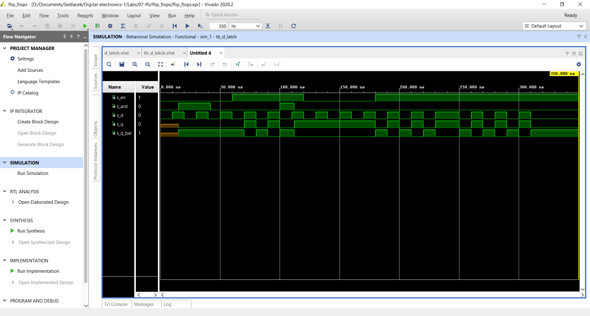
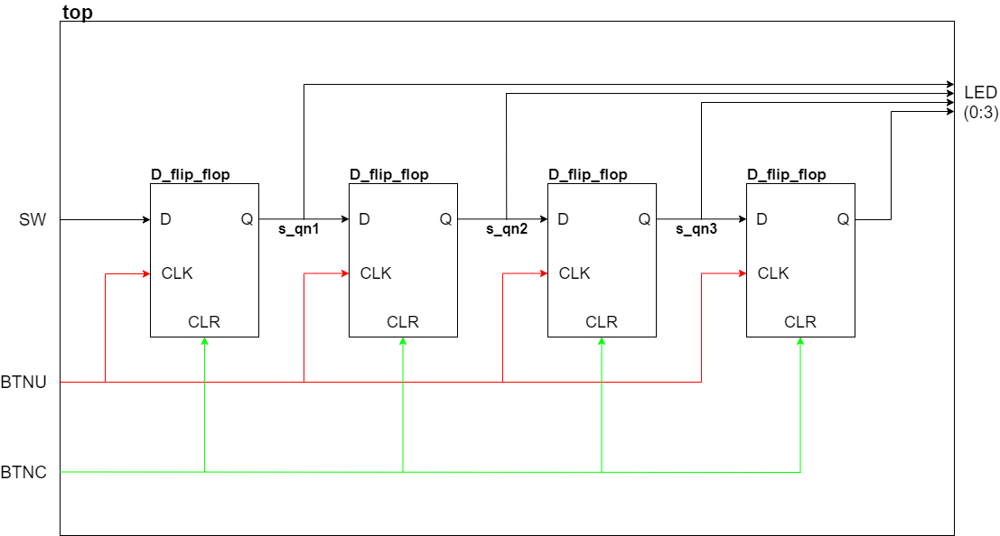

# 07-ffs
## Preparation:


| **clk** | **d** | **q(n)** | **q(n+1)** | **Comments** |
   | :-: | :-: | :-: | :-: | :-- |
   |  | 0 | 0 | 0 | No change |
   |  | 0 | 1 | 0 | Store |
   |  | 1 | 0 | 1 | Store |
   |  | 1 | 1 | 1 | No change |

   | **clk** | **j** | **k** | **q(n)** | **q(n+1)** | **Comments** |
   | :-: | :-: | :-: | :-: | :-: | :-- |
   |  | 0 | 0 | 0 | 0 | No change |
   |  | 0 | 0 | 1 | 1 | No change |
   |  | 0 | 1 | 0 | 0 | Reset |
   |  | 0 | 1 | 1 | 0 | Reset |
   |  | 1 | 0 | 0 | 1 | Set |
   |  | 1 | 0 | 1 | 1 | Set |
   |  | 1 | 1 | 0 | 1 | Toggle |
   |  | 1 | 1 | 1 | 0 | Toggle |

   | **clk** | **t** | **q(n)** | **q(n+1)** | **Comments** |
   | :-: | :-: | :-: | :-: | :-- |
   |  | 0 | 0 | 0 | No change |
   |  | 0 | 1 | 1 | No change |
   |  | 1 | 0 | 1 | Invert(Toggle) |
   |  | 1 | 1 | 0 | Invert(Toggle) |
   
   ## D-latch:
   ### p_d_latch:
      ```vhdl
      p_d_latch : process (d, arst, en)
    begin
        if (arst = '1') then
            q     <= '0';
            q_bar <= '1';
        elsif (en = '1')then
            q <= d;
            q_bar <= not d;
        end if;
    end process p_d_latch;
      ```
   ### tb_d_latch:
     ```vhdl
     p_reset_gen : process
    begin
        s_arst <= '0';
        wait for 15 ns;
        -- Reset activated
        s_arst <= '1';
        wait for 27 ns;
        s_arst <= '0';
        wait for 58 ns;
        -- Reset activated
        s_arst <= '1';
        wait for 12 ns;
        s_arst <= '0';
        wait;
    end process p_reset_gen;

    --------------------------------------------------------------------
    -- Data generation process
    --------------------------------------------------------------------
    p_stimulus : process
    begin
        report "Stimulus process started" severity note;
        
        s_en <= '0';
        s_d <= '0';
        
        --sequence
        wait for 10 ns;
        s_d <= '1';
        wait for 10 ns;
        s_d <= '0';
        wait for 10 ns;
        s_d <= '1';
        wait for 10 ns;
        s_d <= '0';
        wait for 10 ns;
        s_d <= '1';
        wait for 10 ns;
        s_d <= '0';
        --end sequence
        
        s_en <= '1';
        
        --sequence
        wait for 10 ns;
        s_d <= '1';
        wait for 10 ns;
        s_d <= '0';
        wait for 10 ns;
        s_d <= '1';
        wait for 10 ns;
        s_d <= '0';
        wait for 10 ns;
        s_d <= '1';
        wait for 10 ns;
        s_d <= '0';
        --end sequence
        
        s_en <= '0';
        
        --sequence
        wait for 10 ns;
        s_d <= '1';
        wait for 10 ns;
        s_d <= '0';
        wait for 10 ns;
        s_d <= '1';
        wait for 10 ns;
        s_d <= '0';
        wait for 10 ns;
        s_d <= '1';
        wait for 10 ns;
        s_d <= '0';
        --end sequence
        
        s_en <= '1';
        
        --sequence
        wait for 10 ns;
        s_d <= '1';
        wait for 10 ns;
        s_d <= '0';
        wait for 10 ns;
        s_d <= '1';
        wait for 10 ns;
        s_d <= '0';
        wait for 10 ns;
        s_d <= '1';
        wait for 10 ns;
        s_en <= '1';
        wait for 10 ns;
        s_d <= '0';
        --end sequence
        
        --sequence
        wait for 10 ns;
        s_d <= '1';
        wait for 10 ns;
        s_d <= '0';
        wait for 10 ns;
        s_d <= '1';
        wait for 10 ns;
        s_d <= '0';
        wait for 10 ns;
        s_d <= '1';
        wait for 10 ns;
        s_d <= '0';
        --end sequence
        
        report "Stimulus process finished" severity note;
        wait;
    end process p_stimulus;     
     ```
### Waveforms:


## Shift register:

